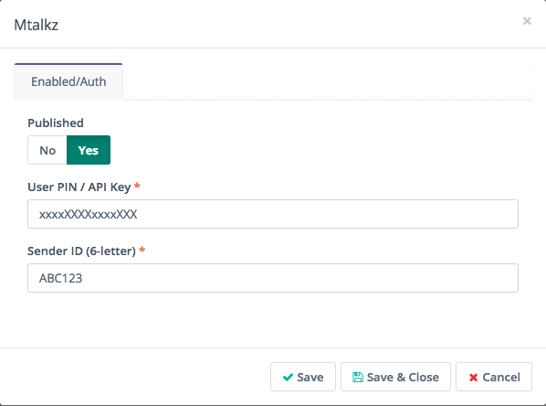
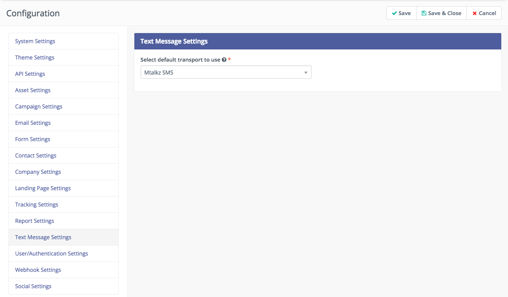

# Mautic Mtalkz Plugin
Mtalkz SMS Transport Integration for >= Mautic 4.0
Provides SMS transport using Mtalkz SMS API Integration

For more info about Mtalkz follow https://www.mtalkz.com/

## Installation by console
1. `composer require mtalkz/mautic-mtalkz-bundle`
2. `php bin/console mautic:plugins:reload`

## Usage
1. Go to Mautic > Settings > Plugins
2. You should see new Mtalkz plugin in the list

3. Publish the plugin and configure it

4. Authentication credentials can be obtained from http://msg.mtalkz.com/
5. Then go to Configuration > Text message settings and select Mtalkz SMS as default transport to use

6. For more info about text message Mautic support, follow docs https://www.mautic.org/docs/en/sms/index.html

## Variables
You can use following variables in your text messages, which will be replaced by corresponding values from the Lead (Contact): `{name}`, `{location}`, `{company}`, `{phone}`, `{email}`, `{title}`, `{firstname}`, `{lastname}`, `{address1}`, `{address2}`, `{city}`, `{state}`, `{country}`, `{zipcode}`